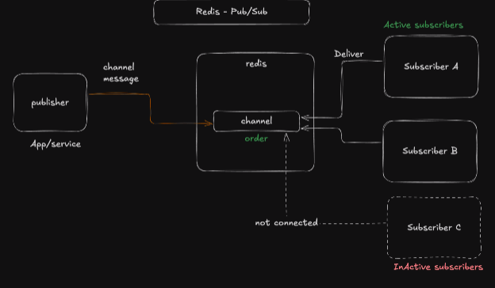

# 07 - Pub/Sub with Redis

Redis Pub/Sub using:

1. A Publisher API built with Express.
2. Two Redis Subscribers listening on the same channel.

## Concept

Publisher -> Redis Channel -> Subscribers

- Publisher sends events to a channel.
- Subscribers listening to that channel receive the event instantly.
- Messages are delivered only to active subscribers at publish time.

## Diagram



## Files

- `index.ts`: Publisher service (HTTP API).
- `subscribers.ts`: Two subscriber clients.

## Channel used

- Channel name: `notifications`

1. Start subscribers:

```bash
npm run dev:sub
```

2. Start publisher API:

```bash
npm run dev:pub
```

Publisher runs on port `3000`.

## Test publishing

Send a POST request:

- URL: `http://localhost:3000/notifications`
- Method: `POST`
- Header: `Content-Type: application/json`
- Body:

```json
{
  "title": "Pub Sub learning with redis"
}
```

Expected response (when two subscribers are active):

```json
{
  "message": "Notification sent to 2 subscribers",
  "status": 200,
  "success": true
}
```

Expected subscriber logs:

```json
    Subscriber 2 received message from notifications :
    {
        title: "Pub Sub learning with redis",
        createdAt: "2026-05-18T11:29:57.885Z",
    }
```

```json
    Subscriber 1 received message from notifications : {
        title: "Pub Sub learning with redis",
        createdAt: "2026-05-18T11:29:57.885Z",
    }
```

## Why you may see "0 subscribers"

If the response says:

```json
{
  "message": "Notification sent to 0 subscribers"
}
```

it means no subscriber process was connected to `notifications` at publish time.

Redis Pub/Sub does not persist messages for offline subscribers.
